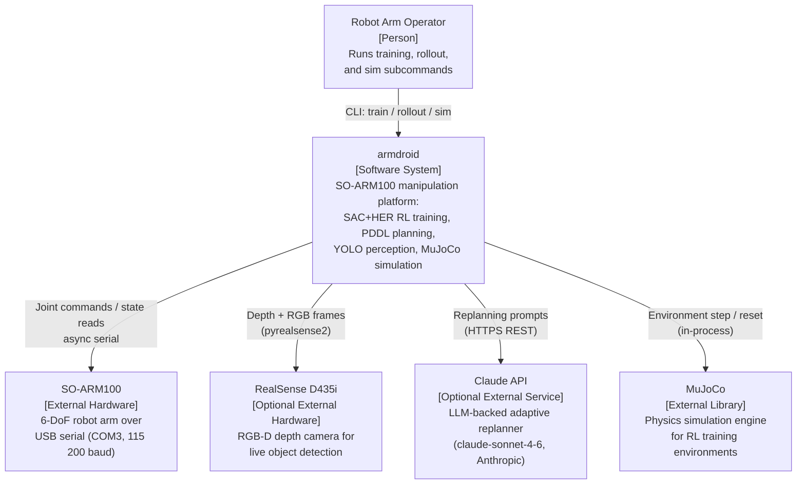
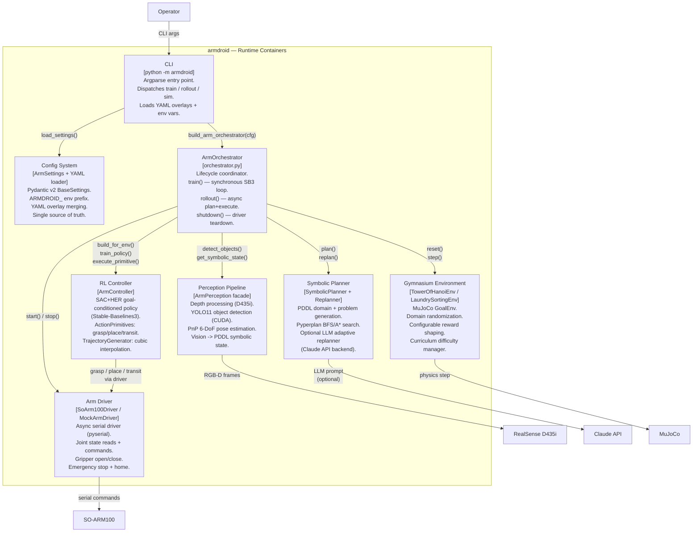
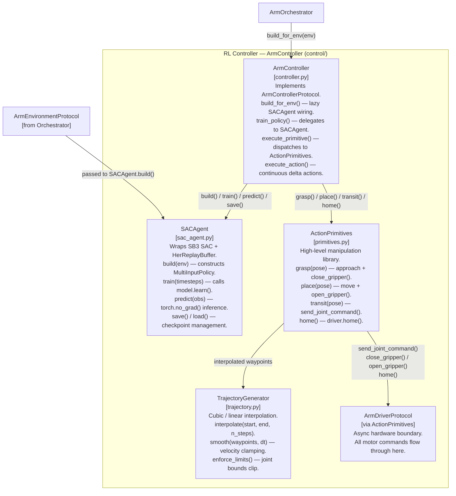

# armdroid — C4 Architecture Model

## Overview

armdroid is a Python robot arm manipulation platform built around a four-layer hierarchical
architecture: vision-based perception, PDDL symbolic planning, goal-conditioned RL control, and
physical hardware execution. The system trains in MuJoCo simulation (SAC+HER) and transfers to a
real SO-ARM100 6-DoF arm over USB serial. All component boundaries are expressed as
`@runtime_checkable` Protocol interfaces; `factory.py` is the single dependency-injection wiring
point.

---

## Level 1 — System Context

---

## Level 2 — Container Diagram

---

## Level 3 — Component Diagram: RL Controller

---

## Key Design Decisions

### Protocol-based dependency injection

Every subsystem boundary is a `@runtime_checkable Protocol` defined in `protocols.py`. The
`ArmOrchestrator` holds references typed as `ArmDriverProtocol`, `ArmPerceptionProtocol`, etc.
Concrete types (`MockArmDriver`, `SoArm100Driver`, `SACAgent`, …) are imported only inside
`factory.py`. This means tests can inject plain Python objects that satisfy the structural protocol
without inheriting from any base class, and swapping implementations (e.g. mock for real driver)
requires no changes outside `factory.py`.

### Async / sync boundary

Stable-Baselines3 `SAC.learn()` is a synchronous, blocking call — it owns the Python thread for
the duration of training. All hardware I/O (`ArmDriverProtocol`, `ArmPerceptionProtocol`) is
`async`. The boundary is explicit: `ArmOrchestrator.train()` is synchronous (called from
`asyncio.run()` wrapper in `main.py`), while `ArmOrchestrator.rollout()` and `shutdown()` are
`async`. ActionPrimitives methods are `async` and are awaited by the synchronous controller only
during rollout, never during the SB3 training loop.

### Factory pattern — single wiring point

`factory.py` contains one `build_*()` function per protocol. The top-level
`build_arm_orchestrator(cfg)` constructs the driver once and passes it to both
`build_arm_controller()` and the orchestrator directly, ensuring exactly one serial connection is
opened to the SO-ARM100. The orchestrator itself does zero construction — it only stores and
coordinates the pre-built components.

### ARMDROID_ environment variable prefix

`ArmSettings` uses `pydantic-settings` with `env_prefix="ARMDROID_"` and
`env_nested_delimiter="__"`. Any config field can be overridden at runtime without touching YAML:
`ARMDROID_ARM__SERIAL_PORT=COM5`, `ARMDROID_MOCK_HARDWARE=true`, etc. This matches the
MouseDroidAGI parent project's `MOUSEDROID_` convention and keeps CI/CD environment injection
clean.
