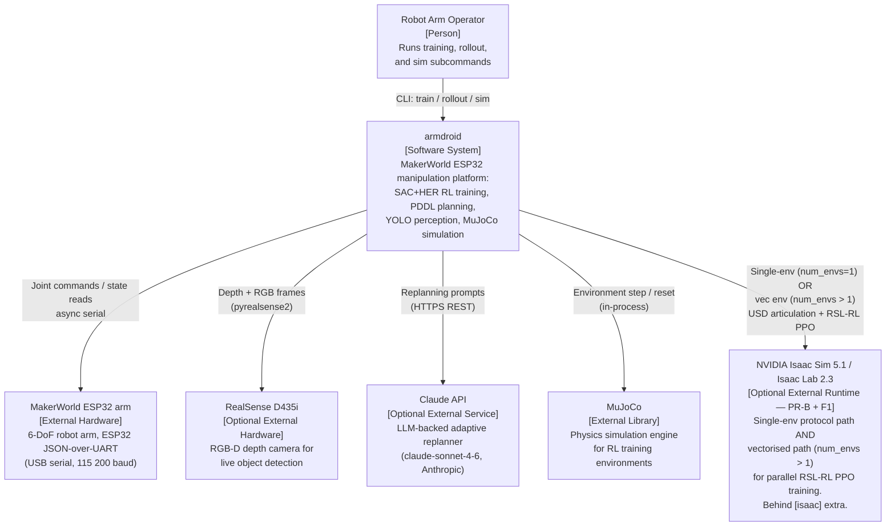
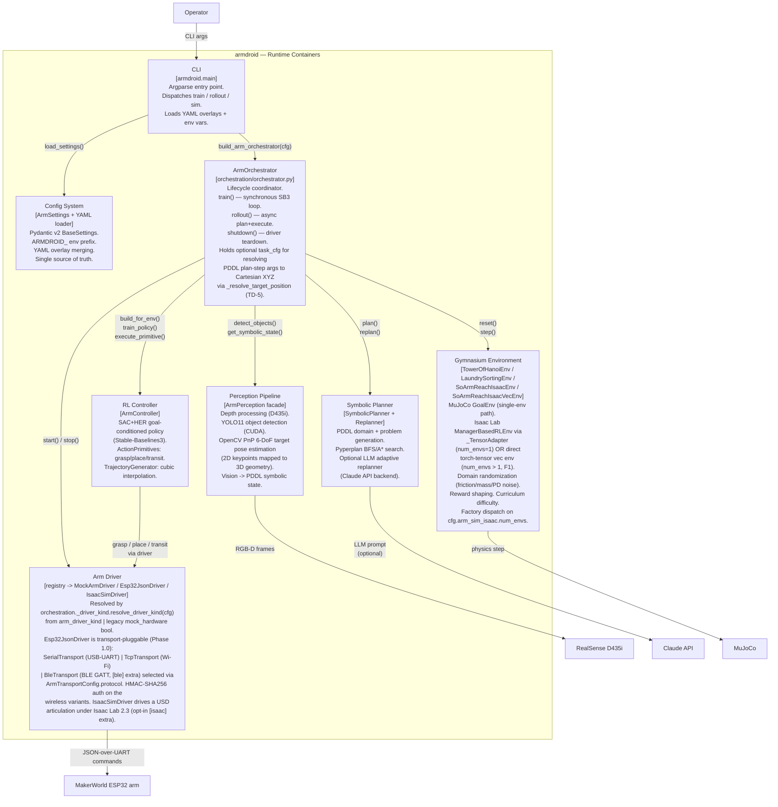
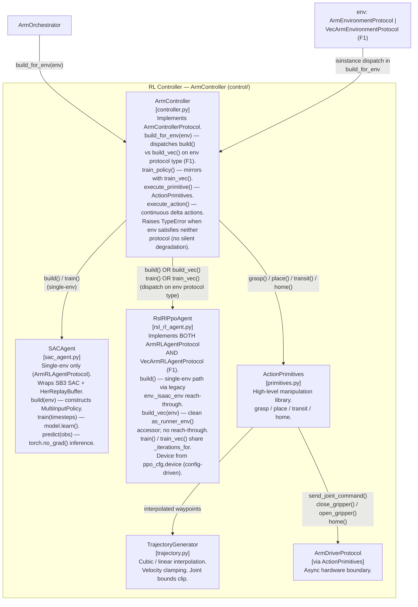
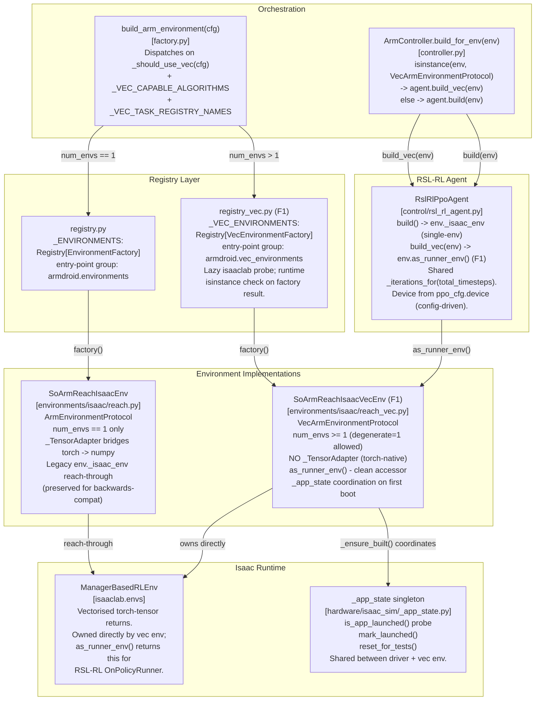
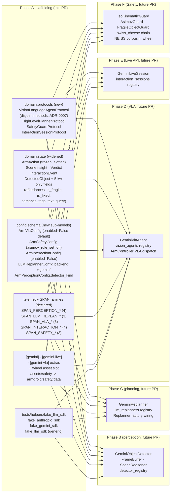

# armdroid — C4 Architecture Model

<!-- markdownlint-disable MD012 -->

## Overview

armdroid is a Python robot arm manipulation platform built around a layered v0.2 architecture: a
stable public API, a pure domain layer, explicit orchestration, registry-backed subsystem seams,
and the runtime perception/planning/control/hardware pipeline used for training and rollout. The
system trains in MuJoCo simulation (SAC+HER) and transfers to a real MakerWorld 6-DoF arm over
ESP32 JSON-over-UART. All component boundaries are expressed as `@runtime_checkable` Protocol
interfaces; `armdroid.orchestration.factory` is the composition root that wires named
implementations together.

---

## Level 1 — System Context



---

## Level 2 — Container Diagram



---

## Level 3 — Component Diagram: RL Controller



---

## Level 3 — Component Diagram: Source Package Layout (v0.2+)

```mermaid
graph TD
    subgraph domain ["armdroid.domain (no internal imports)"]
        d_state["domain.state\nArmState · PlanStep\nSymbolicState · DetectedObject\n+ ArmAction (Phase A)\n+ SceneInsight (Phase A)\n+ Verdict (Phase A)\n+ InteractionEvent (Phase A)"]
        d_err["domain.errors\nArmError hierarchy\n(ArmDriverError · ArmCommandRejected\nArmPlanningError · ArmPerceptionError\nArmConfigurationError)"]
        d_proto["domain.protocols\n@runtime_checkable Protocols\nArmDriverProtocol\nArmControllerProtocol\nArmPlannerProtocol\nArmEnvironmentProtocol\nArmPerceptionProtocol\nArmRLAgentProtocol\n+ VecArmEnvironmentProtocol (F1)\n+ VecArmRLAgentProtocol (F1)\n+ VisionLanguageAgentProtocol (Phase A,\n  disjoint methods build_vla / act /\n  is_vla_built / is_vla_loaded per ADR-0007)\n+ HighLevelPlannerProtocol (Phase A)\n+ SafetyGuardProtocol (Phase A)\n+ InteractionSessionProtocol (Phase A)"]
        d_units["domain.units\nRadians · Metres · Seconds"]
    end

    subgraph config ["armdroid.config"]
        c_schema["config.schema.*\nMulti-module package\nArmSettings · ArmConfig\nTransportConfig · MotionConfig\nControlConfig · PerceptionConfig\n(widened: detector_kind, frame_buffer,\nopen_vocab_max_queries, gemini_* fields)\nPlanningConfig · SimConfig\nArmSimIsaacConfig · RslRlPpoConfig\nLLMReplannerConfig (widened: gemini backend,\napi_endpoint, safety_tier, transport)\n+ ArmVlaConfig (Phase A)\n+ ArmSafetyConfig (Phase A)\n+ ArmInteractionConfig (Phase A)"]
        c_loader["config.loader\nload_settings(path)\nYAML overlay + env merge"]
    end

    subgraph adapters ["Adapters (import domain, not each other)"]
        hw["hardware.*\nMockArmDriver\nEsp32JsonDriver (hardware/esp32/)\nIsaacSimDriver (hardware/isaac_sim/, PR-B)\ndriver_registry"]
        plan["planning.*\nSymbolicPlanner · Replanner\nPDDLDomain · LLM backends\nplanner_registry"]
        perc["perception.*\nArmPerception facade\nDepthProcessor · ObjectDetector\nPoseEstimator · StateExtractor\nperception_registry"]
        ctrl["control.*\nArmController (dispatches single-env vs vec)\nSACAgent (single-env only)\nRslRlPpoAgent (both protocols, F1)\nActionPrimitives · TrajectoryGenerator\nrl_agent_registry: type[ArmRLAgentProtocol]"]
        envs["environments.*\nTowerOfHanoiEnv · LaundrySortingEnv\nSoArmReachIsaacEnv (environments/isaac/, PR-B)\nSoArmReachIsaacVecEnv (F1, num_envs >= 1,\n_app_state Kit coordination)\nDomainRandomizer · CurriculumManager\nenvironment_registry (single-env)\nregistry_vec (F1, sibling for vec env)"]
    end

    subgraph orch ["armdroid.orchestration"]
        o_fac["orchestration.factory\nbuild_arm_driver()\nbuild_arm_controller() — registry-dispatched\nbuild_arm_environment() — dispatches\nsingle-env vs vec on cfg.arm_sim_isaac.num_envs\n+ _VEC_TASK_REGISTRY_NAMES mapping (F1)\nbuild_arm_orchestrator()"]
        o_kind["orchestration._driver_kind\nresolve_driver_kind(cfg)\narm_driver_kind > legacy mock_hardware bool\n(once-per-process DeprecationWarning)"]
        o_orch["orchestration.orchestrator\nArmOrchestrator\ntrain() · rollout() · shutdown()"]
    end

    subgraph cli ["CLI / stable public API"]
        main["armdroid.main\ncli_entry()\nargparse dispatch"]
        api["armdroid.api + armdroid\nStable SemVer public surface\nRe-exports settings, state,\nprotocols, errors, factory helpers,\nand ArmOrchestrator"]
    end

    subgraph compat ["armdroid.compat (deprecation bridge)"]
        shims["Shim modules\nprotocols.py · factory.py\norchestrator.py\nhardware/esp32_json_driver.py"]
        adapter["LegacyArmDriverAdapter\nmaps v0.1 method names\nto v0.2 API"]
    end

    domain --> config
    domain --> adapters
    config --> adapters
    adapters --> orch
    domain --> orch
    orch --> api
    domain --> api
    api --> main
    domain --> compat
    adapters --> compat
```



---

## Level 3 — Component Diagram: Vec Env Path (F1)



See [ADR-0006](ADR/ADR-0006-vec-env-protocol.md) for the eight
architectural decisions behind this layout.

---

## Level 3 — Phase A scaffolding: Gemini Robotics ER 1.6 (`feature/gemini-er`)

Phase A of the Gemini ER 1.6 integration plan lands every wiring slot
that Phases B-F (perception, planning, VLA, Live API, safety) need,
without changing any default behaviour. The diagram below shows the
new protocol slots, config sub-models, and telemetry SPAN families
declared in Phase A; concrete backends light up in subsequent phases.



See [ADR-0007](ADR/ADR-0007-vision-language-agent-protocol.md),
[ADR-0008](ADR/ADR-0008-open-vocabulary-detector.md), and
[ADR-0009](ADR/ADR-0009-safety-middleware.md) for the three Phase A
architectural decisions, and the plan at
`/root/.claude/plans/as-per-the-research-radiant-nova.md` for the
phased implementation schedule.

Backwards-compatibility guarantees (pinned by regression tests):

* `DetectedObject` positional six-arg ctor unchanged. `__slots__`
  tuple pinned by
  [`tests/regression/test_detected_object_compat.py`](../../tests/regression/test_detected_object_compat.py).
* Phase A public-API surface (new value objects + protocols) reachable
  through `armdroid`, `armdroid.api`, and `armdroid.domain` with
  identity-checked re-exports pinned by
  [`tests/regression/test_public_api_phase_a.py`](../../tests/regression/test_public_api_phase_a.py).
* New YAML overlays (`config/examples/gemini.example.yaml`) load
  cleanly with all flags disabled; unknown keys silently dropped
  (pydantic-settings v2 default).
* `pip install -e ".[dev]"` does not pull `google-genai`; the
  `[gemini]`, `[gemini-live]`, `[gemini-vla]` extras are opt-in.

---

## Key Design Decisions

### Layered architecture (v0.2+)

The codebase is organised into five explicit layers, each allowed to import only from layers below it:

```text
┌─────────────────────────────────────────────┐
│  CLI / public API  (armdroid.main, __main__) │
├─────────────────────────────────────────────┤
│  Orchestration     (armdroid.orchestration)  │
│    factory.py  ·  orchestrator.py            │
├────────────────┬────────────────────────────┤
│  Adapters      │  Config                    │
│  hardware/     │  armdroid.config           │
│  planning/     │  schema.*                  │
│  perception/   │                            │
│  control/      │                            │
│  environments/ │                            │
├────────────────┴────────────────────────────┤
│  Domain  (armdroid.domain)                  │
│  state · errors · protocols · units         │
└─────────────────────────────────────────────┘
```

The `armdroid.domain` package has **no internal armdroid imports** — it is a pure-Python island
that resolves in under 10 ms on a cold interpreter. See [ADR-0002](ADR/ADR-0002-domain-layer.md).

### Protocol-based dependency injection

Every subsystem boundary is a `@runtime_checkable Protocol` defined in `armdroid.domain.protocols`.
The `ArmOrchestrator` holds references typed as `ArmDriverProtocol`, `ArmPerceptionProtocol`, etc.
Concrete types (`MockArmDriver`, `Esp32JsonDriver`, `SACAgent`, …) are imported only inside
`armdroid.orchestration.factory`. This means tests can inject plain Python objects that satisfy the
structural protocol without inheriting from any base class, and swapping implementations requires no
changes outside the factory module.

### Registry-based extension points (v0.2+)

Each subsystem exposes a `Registry[T]` singleton populated at import time. Out-of-tree packages
declare implementations via `[project.entry-points."armdroid.drivers"]` (etc.) in their
`pyproject.toml` — no fork required. The current composition root resolves drivers and
environments through these registries, and the same seam is available for the other subsystems as
their composition points are expanded. See [ADR-0003](ADR/ADR-0003-registry-pattern.md).

### Shim deprecation strategy (v0.2+)

Moved modules (`armdroid.protocols`, `armdroid.factory`, `armdroid.orchestrator`,
`armdroid.hardware.esp32_json_driver`) are preserved as shims that emit `DeprecationWarning` on
import and re-export all previously public names. Shims will be deleted at v0.4.0. For migration
instructions see [docs/migration/v0.1-to-v0.2.md](../migration/v0.1-to-v0.2.md). See also
[ADR-0004](ADR/ADR-0004-shim-deprecation.md).

### Async / sync boundary

Stable-Baselines3 `SAC.learn()` is a synchronous, blocking call — it owns the Python thread for
the duration of training. All hardware I/O (`ArmDriverProtocol`, `ArmPerceptionProtocol`) is
`async`. The boundary is explicit: `ArmOrchestrator.train()` is synchronous (called from
`asyncio.run()` wrapper in `main.py`), while `ArmOrchestrator.rollout()` and `shutdown()` are
`async`. ActionPrimitives methods are `async` and are awaited by the synchronous controller only
during rollout, never during the SB3 training loop.

### Factory pattern — single wiring point

`armdroid.orchestration.factory` contains one `build_*()` function per protocol. The top-level
`build_arm_orchestrator(cfg)` constructs the driver once, resolves the configured driver and
environment through typed registries, and passes the shared driver to both
`build_arm_controller()` and the orchestrator directly. This keeps exactly one serial connection
open to the MakerWorld ESP32 arm. The orchestrator itself does zero construction — it only stores
and coordinates the pre-built components.

### ARMDROID_ environment variable prefix

`ArmSettings` uses `pydantic-settings` with `env_prefix="ARMDROID_"` and
`env_nested_delimiter="__"`. Any config field can be overridden at runtime without touching YAML:
`ARMDROID_ARM__TRANSPORT__SERIAL_PORT=COM5`, `ARMDROID_MOCK_HARDWARE=true`, etc. This matches the
MouseDroidAGI parent project's `MOUSEDROID_` convention and keeps CI/CD environment injection
clean.

See the ADRs in this directory for the detailed rationale behind the v0.2 layering,
registry, and compatibility decisions.

