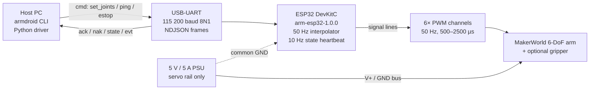
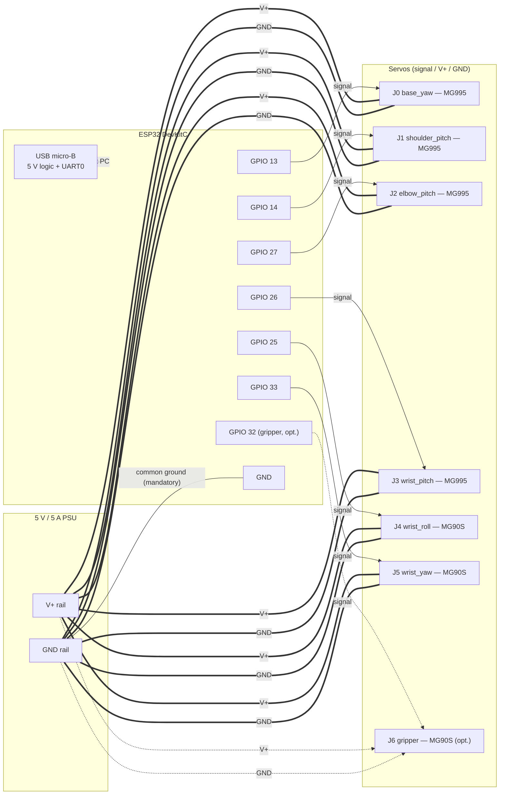
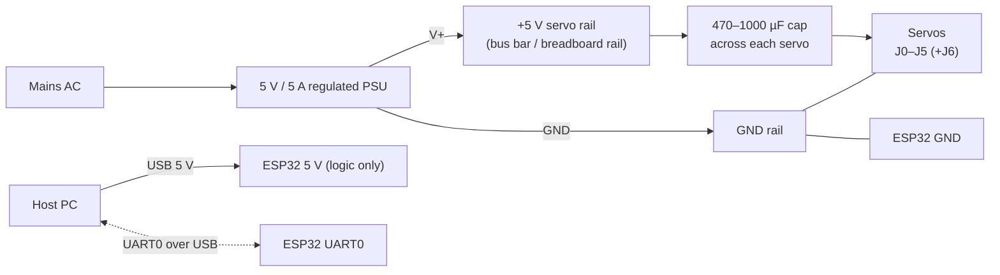

# armdroid — Wiring & Construction Blueprints

Construction-time reference for the physical arm. Combines the **mechanical
design** (the printable [MakerWorld 6-DoF arm, model
1134925](https://makerworld.com/models/1134925)) with the **electrical /
firmware contract** defined in this repository.

The host driver, firmware codegen, and this document share a single source
of truth for the pin map, joint count, and pulse calibration:

- Host config schema: [`src/armdroid/config/schema/arm.py`](../../src/armdroid/config/schema/arm.py)
  (`ArmServoConfig`, `_default_servos_6dof`)
- Firmware header (auto-generated): [`firmware/arm_esp32/src/config_generated.h`](../../firmware/arm_esp32/src/config_generated.h)
- Firmware wiring table: [`firmware/arm_esp32/README.md`](../../firmware/arm_esp32/README.md#wiring)
- Wire protocol: [`firmware/arm_esp32/PROTOCOL.md`](../../firmware/arm_esp32/PROTOCOL.md)

If you change a pin or pulse range, edit the YAML / `ArmConfig` defaults
and regenerate the header — do **not** edit the diagrams here in isolation.

---

## 1. Bill of materials

| Qty | Item                                  | Notes                                                                 |
|-----|---------------------------------------|-----------------------------------------------------------------------|
| 1   | MakerWorld 6-DoF printed arm kit      | [Model 1134925](https://makerworld.com/models/1134925) — printed parts, hardware pack |
| 4   | MG995 metal-gear servo (180°)         | Joints 0–3 (base, shoulder, elbow, wrist pitch). ~1 A peak each.      |
| 2–3 | MG90S micro servo (180°)              | Joints 4–5 (wrist roll, wrist yaw); +1 for joint 6 gripper if fitted. |
| 1   | ESP32 DevKitC (or equivalent ESP32)   | USB-UART bridge, 38-pin DevKitC layout assumed.                       |
| 1   | 5 V / 5 A regulated PSU               | **Servo rail only.** Do not power servos from ESP32 5 V.              |
| 1   | USB-A → micro-USB cable               | ESP32 power + serial to host PC.                                      |
| —   | Dupont jumpers / JST-XH pigtails      | Servo signal harness to ESP32 GPIO header.                            |
| 4–7 | 470 µF–1000 µF electrolytic caps       | One per servo across V+/GND, close to servo connector (anti-droop).   |
| 1   | Common-ground bus bar / terminal      | PSU GND ↔ ESP32 GND tied together.                                    |
| —   | M2 / M3 hardware, bearings            | Per the MakerWorld kit BOM.                                           |

> The 7th joint (gripper) ships in commit 7 of the ESP32 integration. The
> default `ArmConfig.dof = 6` and the codegen still emits 6 servo pins;
> joint 6 / GPIO 32 below is the planned wiring once the gripper is enabled.

---

## 2. System-level signal flow



The host never drives a servo directly. All motion goes through the
firmware's joint-space cubic interpolator, which is why pulse calibration
and joint limits live in the codegen header rather than in driver code.

---

## 3. ESP32 pin map (default 6-DoF + planned gripper)

Mirrors `firmware/arm_esp32/README.md`. Row 6 is the planned 7-DoF
gripper; the current `_default_servos_6dof` only emits rows 0–5.

| Joint              | Servo  | ESP32 GPIO | Pulse (µs) min/max | Travel        |
|--------------------|--------|------------|--------------------|---------------|
| 0 base_yaw         | MG995  | **13**     | 500 / 2500         | ±π/2 rad      |
| 1 shoulder_pitch   | MG995  | **14**     | 500 / 2500         | −0.5…+π/2 rad |
| 2 elbow_pitch      | MG995  | **27**     | 500 / 2500         | ±π/2 rad      |
| 3 wrist_pitch      | MG995  | **26**     | 500 / 2500         | ±π/2 rad      |
| 4 wrist_roll       | MG90S  | **25**     | 500 / 2500         | ±π/2 rad      |
| 5 wrist_yaw        | MG90S  | **33**     | 500 / 2500         | ±π/2 rad      |
| 6 gripper (opt.)   | MG90S  | **32**     | 500 / 2500         | normalised 0…1 |

**Pins to avoid** on ESP32 DevKitC:

- Strapping pins: GPIO 0, 2, 5, 12, 15 — wrong boot mode if pulled by a servo.
- Input-only pins: GPIO 34, 35, 36, 37, 38, 39 — no PWM output capability.
- USB-UART pins: GPIO 1 (TX0), 3 (RX0) — owned by the protocol link.

---

## 4. Wiring diagram

Each servo is a 3-wire device: signal (orange/yellow), V+ (red),
GND (brown/black). Signal goes to the ESP32 GPIO; V+/GND go to the
**servo rail PSU**, never the ESP32's onboard 5 V regulator.



**Critical:** the PSU GND rail and the ESP32 GND must be tied together.
PWM is referenced to GND; without a common ground the servos see
floating signal and twitch / chatter.

---

## 5. Power distribution



Sizing check: 4× MG995 @ ~1 A peak + 3× MG90S @ ~0.6 A peak ≈ **5.8 A
worst case stall**. A 5 V / 5 A supply is sufficient for typical Tower of
Hanoi motion (servos rarely peak simultaneously) but headroom matters —
size up to 6–8 A if you observe brownouts or watchdog-latched e-stops
under load.

---

## 6. Mechanical blueprint (joint stack-up)

The MakerWorld model is the canonical mechanical reference; the diagrams
below capture only the **kinematic stack-up** and joint axes the firmware
expects, in the same order as the pin map.

### Side elevation

```text
                              ┌──────────┐
                              │ gripper  │  J6  (opt., GPIO 32, 0..1)
                              └────┬─────┘
                              ┌────┴─────┐
                              │ wrist_yaw│  J5  (GPIO 33, MG90S, ±π/2)
                              └────┬─────┘
                              ┌────┴─────┐
                              │wrist_roll│  J4  (GPIO 25, MG90S, ±π/2)
                              └────┬─────┘
                              ┌────┴─────┐
                              │wrist_pit.│  J3  (GPIO 26, MG995, ±π/2)
                              └────┬─────┘
                                   │  forearm link
                              ┌────┴─────┐
                              │  elbow   │  J2  (GPIO 27, MG995, ±π/2)
                              └────┬─────┘
                                   │  upper-arm link
                              ┌────┴─────┐
                              │ shoulder │  J1  (GPIO 14, MG995, −0.5..+π/2)
                              └────┬─────┘
                              ┌────┴─────┐
                              │   base   │  J0  (GPIO 13, MG995, ±π/2)
                              └────┬─────┘
                          ════════╧════════   baseplate / bench
```

### Top view (joint axes)

```text
                       +Y
                        │
                        │       J0 axis: vertical (yaw)
                        │       J1/J2/J3 axis: horizontal pitch
                        │       J4 axis: along forearm (roll)
            ────────────┼────────────  +X      J5 axis: vertical at wrist (yaw)
                        │
                        │   ◯  ←  base footprint, J0 rotates here
                        │
                       −Y
```

### Coordinate convention

- Base origin at the centre of the J0 axis, on the baseplate.
- +Z up, +X out the front of the arm at home (`q = [0,0,0,0,0,0]`).
- All rotational joints in radians; gripper joint (when fitted) is
  normalised `[0, 1]` with `0 = open`, `1 = closed`. This matches
  `firmware/arm_esp32/PROTOCOL.md` and the `set_joints` payload.

The `assets/so_arm/so101/so101_new_calib.urdf` URDF is the simulation
twin used by MuJoCo and the trained policy; the hardware kinematics
must match it joint-for-joint or sim-to-real transfer will fail.

---

## 7. Construction notes

1. **Common ground first.** Before powering anything else, bond the PSU
   GND rail to ESP32 GND. PWM is single-ended.
2. **No servos on the ESP32 5 V.** The DevKitC AMS1117 cannot source the
   inrush current of even a single MG995. Use the dedicated rail.
3. **Decouple at each servo.** A 470–1000 µF electrolytic across V+/GND
   close to each servo connector prevents the rail droop that shows up
   as buzz, chatter, or random firmware reboots.
4. **Strapping pins.** Never wire a servo signal to GPIO 0, 2, 5, 12, or
   15. They control boot mode; a servo idle pull will brick the boot.
5. **Match the codegen.** The pulse-min / pulse-max in
   `config_generated.h` is the floor — joint limits live in radians at
   the host but pulse widths at the firmware. Re-run
   `python scripts/gen_firmware_config.py` after any YAML change.
6. **Watchdog window.** The firmware latches e-stop after 2 s without
   host traffic (`watchdog_timeout_s`). The Python driver pings at
   0.5 s. If you run the firmware standalone for bench testing, send a
   `ping` cmd at least every 1 s or it will fault.
7. **Cable strain relief.** The wrist joints (J3–J5) carry the servo
   harness in a moving link — leave a service loop and zip-tie at each
   joint or the harness will pull the connector after a few cycles.

---

## 8. Bring-up checklist

Run in this order; each step gates the next.

| # | Step                                                  | Pass criterion                                           |
|---|-------------------------------------------------------|----------------------------------------------------------|
| 1 | Visual inspection: GND tied, no shorts on V+/GND      | Continuity beep PSU GND ↔ ESP32 GND                      |
| 2 | Power PSU **without** servo signals connected         | 5 V ± 0.1 V on rail, no smoke                            |
| 3 | Flash firmware (`pio run -e esp32dev -t upload`)      | `{"t":"evt","kind":"boot","ver":"arm-esp32-1.0.0",...}`  |
| 4 | Connect signal lines one at a time                    | `state` heartbeat at ~10 Hz, `q` reads home pose         |
| 5 | `python -m armdroid --mock-hardware sim`              | Sanity-check the toolchain on host                       |
| 6 | `ARMDROID_MOCK_HARDWARE=false python -m armdroid ... rollout` | Arm executes Tower of Hanoi against the real driver |
| 7 | Yank USB mid-motion                                   | Firmware latches e-stop within 2 s, all servos hold pose |

---

## 9. Cross-references

- C4 system / container / component diagrams: [`docs/architecture/C4.md`](C4.md)
- Phase plan and driver decomposition: [`docs/architecture/PHASES.md`](PHASES.md)
- Wire protocol details (frames, error codes, e-stop semantics): [`firmware/arm_esp32/PROTOCOL.md`](../../firmware/arm_esp32/PROTOCOL.md)
- Firmware build / flash / test instructions: [`firmware/arm_esp32/README.md`](../../firmware/arm_esp32/README.md)
- URDF / sim twin: [`assets/so_arm/so101/so101_new_calib.urdf`](../../assets/so_arm/so101/so101_new_calib.urdf)
